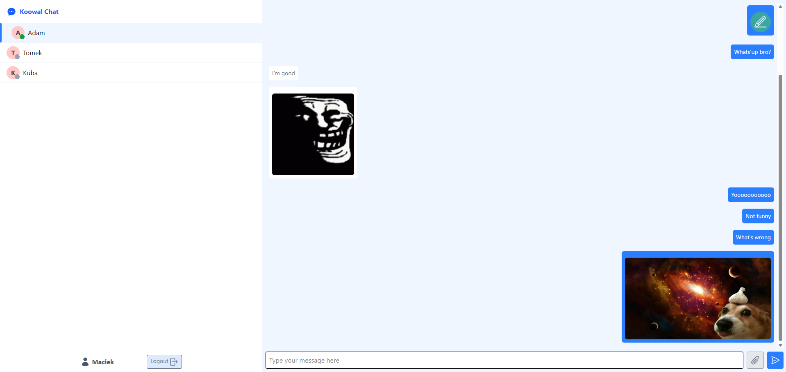

# Koowal Chat

A real-time chat application with user authentication, online presence indicators, and file sharing capabilities.



## Features

- **Real-time Messaging**: Instant communication between users
- **User Authentication**: Secure login and registration system
- **Online Status**: See which users are currently online
- **Message History**: Access previous conversations
- **File Sharing**: Send and receive images
- **Responsive Design**: Works on desktop and mobile devices

## Tech Stack

### Frontend
- React.js
- Tailwind CSS for styling
- Axios for API requests
- WebSockets for real-time communication

### Backend
- Node.js with Express
- MongoDB with Mongoose
- JWT for authentication
- WebSocket server (ws)
- ImageKit for file storage

## Project Structure

```
├── Frontend/
│   ├── src/
│   │   ├── Components/
│   │   │   ├── AuthForm.jsx     # Login/Register form
│   │   │   ├── Avatar.jsx       # User avatar component
│   │   │   ├── Chat.jsx         # Main chat interface
│   │   │   ├── Contact.jsx      # Contact list item
│   │   │   └── Logo.jsx         # App logo component
│   │   ├── Context/
│   │   │   └── userContext.jsx  # User authentication context
│   │   ├── Routes/
│   │   │   └── Routes.jsx       # Application routing
│   │   ├── Utility/
│   │   │   └── apiRequest.js    # Axios configuration
│   │   ├── App.jsx              # Root component
│   │   ├── main.jsx             # Entry point
│   │   └── index.css            # Global styles
│
├── Backend/
│   ├── db/
│   │   └── db.js                # Database connection
│   ├── models/
│   │   ├── message.model.js     # Message schema
│   │   └── user.model.js        # User schema
│   └── index.js                 # Server entry point
```

## Getting Started

### Prerequisites

- Node.js (v14+)
- MongoDB
- ImageKit account (for file storage)

### Environment Variables

#### Frontend (.env)
```
VITE_API_ENDPOINT=http://localhost:3000
```

#### Backend (.env)
```
MONGO_URL=your_mongodb_connection_string
JWT_SECRET=your_jwt_secret
CLIENT_URL=http://localhost:5173
IMAGEKIT_PUBLIC_KEY=your_imagekit_public_key
IMAGEKIT_PRIVATE_KEY=your_imagekit_private_key
IMAGEKIT_URL_ENDPOINT=your_imagekit_url_endpoint
```

### Installation

1. Clone the repository
   ```
   git clone https://github.com/yourusername/koowal-chat.git
   cd koowal-chat
   ```

2. Install backend dependencies
   ```
   cd Backend
   npm install
   ```

3. Install frontend dependencies
   ```
   cd ../Frontend
   npm install
   ```

4. Start the backend server
   ```
   cd ../Backend
   npm start
   ```

5. Start the frontend development server
   ```
   cd ../Frontend
   npm run dev
   ```

6. Access the application at `http://localhost:5173`

## Usage

1. **Register or Login**: Create a new account or login with existing credentials
2. **Select a Contact**: Click on a user from the sidebar to start chatting
3. **Send Messages**: Type in the input field and press send
4. **Share Files**: Click the attachment icon to upload and send images

## Deployment

### Backend
The backend is configured to be deployed on platforms like Render, with the WebSocket server attached to the same HTTP server.

### Frontend
The frontend can be deployed on Netlify, Vercel, or any static site hosting service.

## Contributing

1. Fork the repository
2. Create a feature branch (`git checkout -b feature/amazing-feature`)
3. Commit your changes (`git commit -m 'Add some amazing feature'`)
4. Push to the branch (`git push origin feature/amazing-feature`)
5. Open a Pull Request

## License

This project is licensed under the MIT License - see the LICENSE file for details.

## Acknowledgments

- [Tailwind CSS](https://tailwindcss.com/)
- [React](https://reactjs.org/)
- [Express](https://expressjs.com/)
- [MongoDB](https://www.mongodb.com/)
- [ImageKit](https://imagekit.io/)